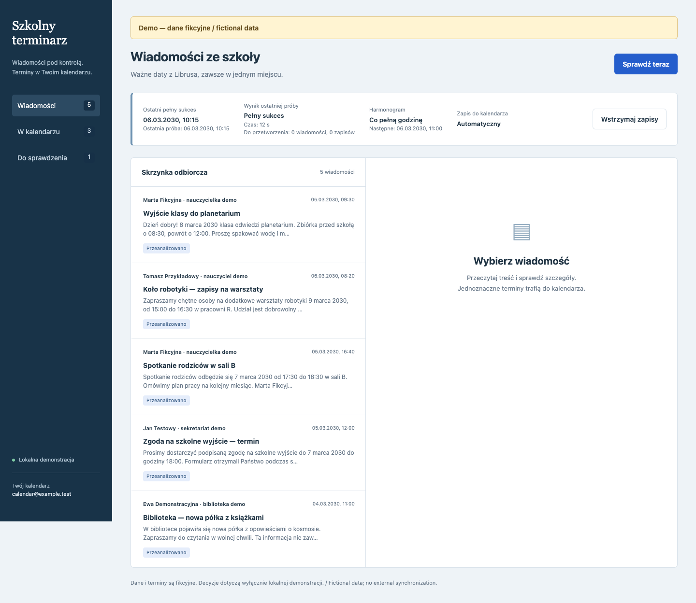
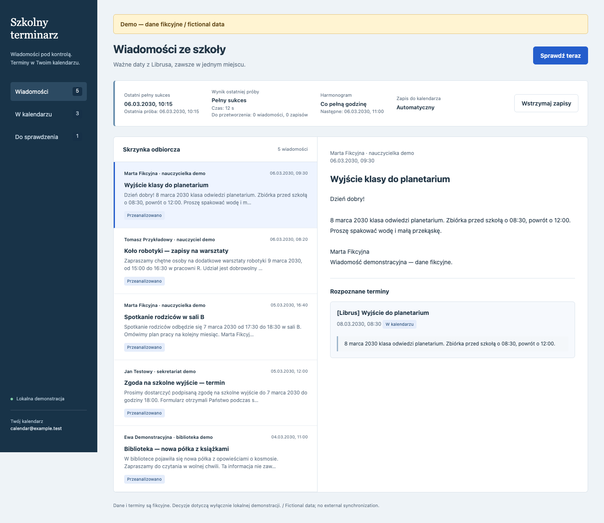
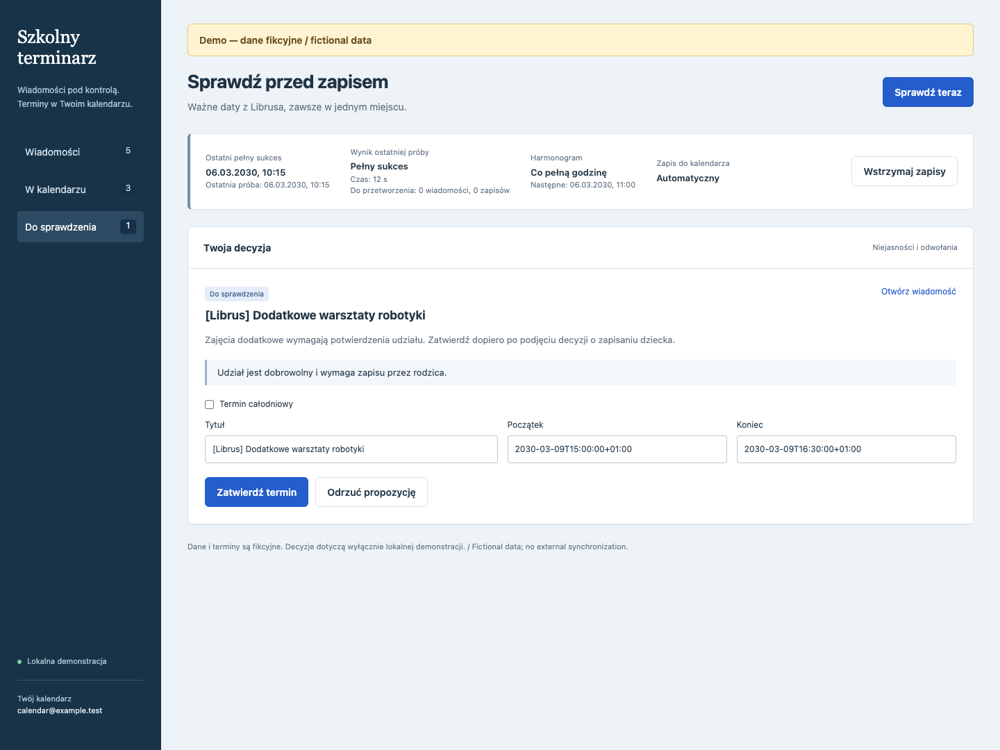
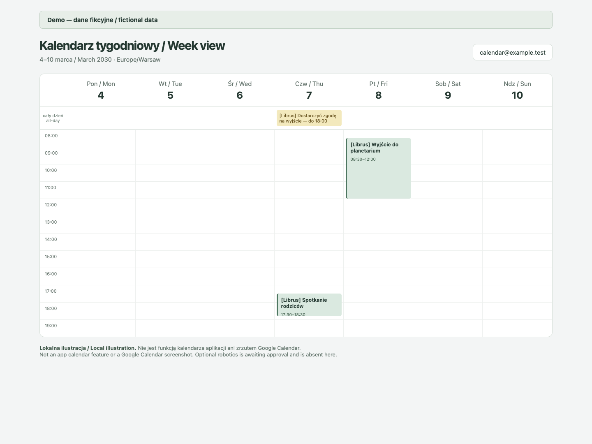

# Librus Calendar

[Polski](README.pl.md) · [Setup](docs/setup.md) · [Demo](docs/demo.md) · [Architecture & safeguards](docs/architecture.md)

A private school inbox that turns messages from **Librus Synergia** into Google Calendar entries, with a review queue for decisions that need a parent.

It reads messages **directly from Librus**. Gmail notifications are not the ingestion source or a trigger. The web interface is currently in Polish.



*Demo — dane fikcyjne / fictional data. All screenshots use newly authored synthetic messages and fake teachers.*

## What it does

- Keeps message bodies, recognized actions, analysis provenance and calendar snapshots in a local SQLite database.
- Automatically queues clear future school events, reminders and deadlines when calendar writes are enabled. Optional extracurricular activities require participation approval; ambiguity, conflicts and cancellations require review.
- Adds one `[Librus]` title prefix. Descriptions include the source quote, an ownership marker and a **synchronization-start timestamp** in Europe/Warsaw. That timestamp means preparation of the durable operation, not confirmation of a completed calendar write.
- Modifies only app-owned entries on the configured calendar, sends no invitations, and reconciles possible writes before retrying.
- Provides a private Tailscale inbox, an hourly systemd sync, daily SQLite backups and optional Netdata health checks.

## Try it locally

Python **3.12+** is required. The demo needs no Librus credentials, Codex login, connected calendar or account configuration.

```sh
python3 -m venv .venv
.venv/bin/python -m pip install -r requirements.txt
.venv/bin/python scripts/ui_fixture.py
```

Open [http://127.0.0.1:8795](http://127.0.0.1:8795). The real app UI runs against a temporary database, with a fixed clock in March 2030. Approval and sync controls affect only demo state; closing the process removes it. No Librus, AI or external calendar call occurs. See [demo reproduction](docs/demo.md).

## A message, a decision, a calendar entry



*Actual app UI. The recognized result is seeded synthetic data; no model was called.*



*The optional robotics workshop awaits participation approval.*



*Local illustration of the same week's entries — **not an app calendar feature or a Google Calendar screenshot**. The unapproved robotics workshop is absent.*

## Use with your own accounts

Real synchronization requires your Librus account, a supported authenticated Codex CLI runtime, an available analysis/tool model, a connected Google Calendar app and write access to the exact configured calendar. These prerequisites are **not bundled**; model names, connector identifiers and supported tools can vary by account and runtime. This is not a standalone OAuth integration. Start with the [configuration and deployment guide](docs/setup.md).

Writes start paused. An initial `sync --dry-run` can still read Librus and invoke AI/calendar read tools; it is not the offline demo. Check the recognized actions and runtime probe before enabling writes.

## Privacy and limitations

This is an **unofficial**, independently maintained integration, unaffiliated with Librus, Google or OpenAI. It uses undocumented Librus authentication/message interfaces, which can change. It handles messages, not the full timetable, grades or every school feature; attachment contents are not analyzed.

Message text is private data. Real analysis sends supplied message text and relevant cached event context to the configured AI service; calendar writes send selected event details and source quotes to Google Calendar. Store credentials, database files and backups outside the repository, use restricted file permissions, and keep the interface behind owner-restricted Tailscale access. See [privacy and operating boundaries](docs/architecture.md).

AI can misinterpret dates and context. Automated tests and this offline UI demo do not prove compatibility with your school, your Codex account, your Google Calendar or a live deployment. Inspect early results and keep backups.

## Development

```sh
.venv/bin/python -m unittest discover -s tests -v
```

The project originated as a personal proof of concept. This public edition contains configurable source code, generic deployment examples and synthetic fixtures; production credentials, messages, state and private deployment evidence are excluded. See [architecture](docs/architecture.md) and the internal [application contract](app/CONTRACT.md).

Licensed under [MIT](LICENSE).
